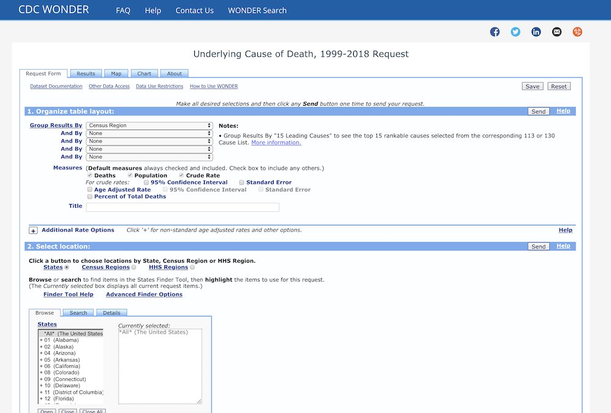

```{r setup, include=FALSE}
knitr::opts_chunk$set(echo = FALSE)
library(tidyverse)
```


<!-- Lia -->
## OUR INTERESTS 

- <font size="8">Health data: </font>
- <font size="6">How are people dying? </font>
- <font size="6">How does this change based on different groups? </font>
- <font size="6"><font color="light blue">Center for Disease Control: race, age, year, cause of death, etc. data </font></font>

<!-- Dawson -->
## TWO PROBLEMS

- <font size="6">Problem 1: Can't make good looking visualizations using the APP </font>
- <font size="6">Problem 2: Can't download over 75,000 rows of data at a time </font>

<!-- Dawson -->
## SOLUTION

- CDC DATA VISUALIZER SHINY APP

<!-- Lia -->
## RAW DATA

- 19 .txt files ->  1 .CSV file




<!-- Lia -->
## DATA CLEAN UP

```{r message=FALSE, warning=FALSE}
cdc_1999 <- readr::read_csv("data/raw/year_1999.csv")
```

```{r cdc, echo = TRUE}
glimpse(cdc_1999)
```

<!-- Dawson -->
## EXAMPLE DATA TRANSFORMATION


<!-- Dawson -->
## THE SHINY APP!

```{r pressure}
plot(pressure)
```

